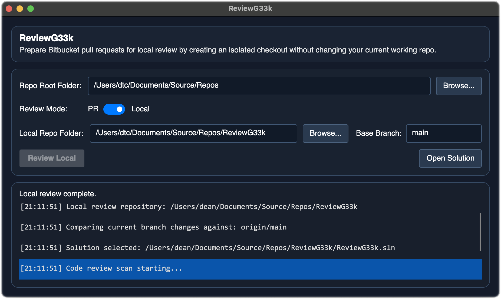
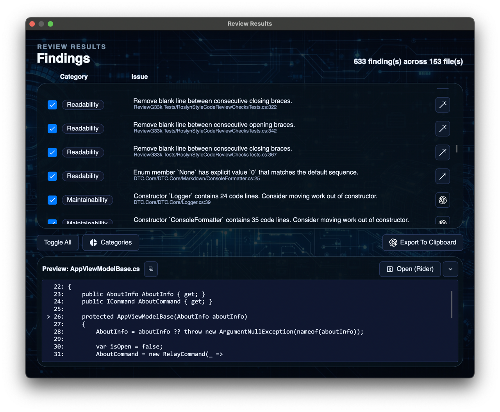
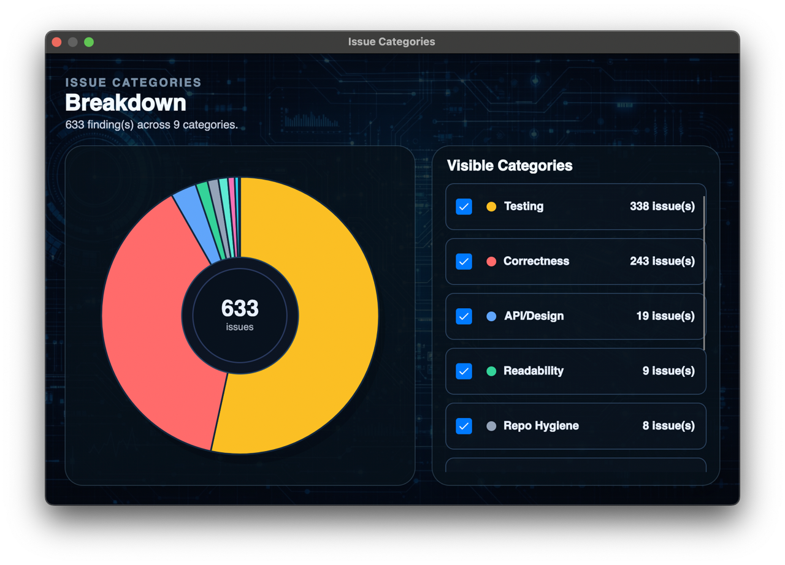

[](https://twitter.com/deanthecoder)

<p align="center">
  
</p>

# ReviewG33k
ReviewG33k is a lightweight desktop app for fast, practical code reviews. It mainly targets C#/.NET projects, with a smaller amount of generic source-file support for things like C/C++ discovery and lighter-weight checks. Give it a Bitbucket pull request or a local repository, let it scan the code, and jump straight to the right file.



## Other windows
### Review Results
The main review workspace: categorized findings, source preview, quick fixes, export, and one-click open actions.



### Issue Categories
A compact pie-chart view with live category toggles, so you can hide whole issue types while you review.



## What it can do
- Review **Bitbucket pull requests** by pasting or dropping a PR URL.
- Review **local committed changes**, **local uncommitted changes**, or an **entire local repository**.
- Switch between **changed lines** and **full modified files** depending on how thorough you want the scan to be.
- Prepare isolated review worktrees so your normal working tree stays untouched.
- See findings grouped into clear categories like `Correctness`, `Threading`, `UI`, and `Repo Hygiene`.
- Open findings in **VS Code**, **Visual Studio**, **Rider**, your **file browser**, or copy the location to the **clipboard**.
- Apply supported quick fixes, export findings, generate Codex prompts, and optionally post Bitbucket PR comments.
- Filter the results live by category using the category breakdown window.

## How it works (high level)
1. Pick a review mode.
2. ReviewG33k gathers the relevant files or diff.
3. It runs focused checks over that code.
4. You review, filter, fix, export, open, or comment on the results.

## Quick start
- **Pull request review**: choose a repo root, paste or drop a PR URL, then click **Review PR**.
- **Local committed review**: choose **Local committed changes**, pick a repo and base branch, then click **Review Local**.
- **Local uncommitted review**: choose **Local uncommitted changes**, pick a repo, then click **Review Local**.
- **Whole-repository review**: choose **Entire local repository**, pick a repo, then click **Review Local**.

## Build and run
Prereqs: .NET 8 SDK and `git`.

Optional tools:
- VS Code `code` CLI for opening findings in VS Code
- Visual Studio, Rider, or a desktop file browser for alternative open targets

```bash
dotnet build ReviewG33k.sln
dotnet run --project ReviewG33k.csproj
```

## Supported checks
### Finding categories (results view)
ReviewG33k labels each finding with one of these categories:
- `Correctness`
- `Threading`
- `Performance`
- `Resources`
- `API/Design`
- `Readability`
- `Maintainability`
- `Testing`
- `Documentation`
- `UI`
- `Repo Hygiene`

### Async and threading
| Check | What it flags |
| --- | --- |
| Async void (non-event handlers) | `async void` methods that are likely to hide failures. |
| Async method naming | `async` methods that do not end with `Async`. |
| Task.Run(async ...) | Async work wrapped in `Task.Run(...)` where it may be unnecessary or risky. |
| Unobserved task results | Fire-and-forget task calls whose result is ignored. |
| Thread.Sleep usage | Blocking sleeps in newly added code paths. |
| Lock targets | `lock(this)` or locks on likely public objects. |

### Exceptions and reliability
| Check | What it flags |
| --- | --- |
| Empty catch blocks | `catch` blocks with no real handling logic. |
| Swallowing catch blocks | `catch` blocks that silently consume exceptions. |
| `throw ex;` in catch blocks | Re-throw patterns that lose original stack trace context. |
| `IDisposable` not disposed | Disposable objects created without clear disposal. |
| Dispose method without `IDisposable` | Types that define `Dispose()` but do not implement `IDisposable`. |
| Constructor event subscription lifecycle | Constructors that subscribe to events without clear unsubscribe/disposal lifecycle. |
| Multiple enumeration | Re-enumerating deferred `IEnumerable` values unexpectedly. |
| Public method argument guards | Missing null guards in newly added public methods. |
| Numeric formatting for file output | `double`/`float`/`decimal` converted to text for file writes without `InvariantCulture`. |

### Design and maintainability
| Check | What it flags |
| --- | --- |
| Property can be auto-property | Verbose property patterns that can be simplified to auto-properties. |
| Private get-only property should be field | Private get-only auto-properties better represented as fields. |
| Private property should be field | Simple private properties that are effectively field wrappers. |
| Private field can be readonly | Private fields written only during construction. |
| Private readonly field only used in constructor | Private readonly fields whose references are confined to constructor setup and can likely become local variables. |
| Method can be static | Instance methods that do not use instance state. |
| Local variable can be const | Local values that never change and can safely be `const`. |
| Unused local variables | Local variables that are declared/assigned but never read. |
| Multiple classes per file | Files that define more than one class (prefer one class per file). |
| Redundant self lookup | Needlessly resolving an object from itself (or equivalent redundant lookup). |
| Public mutable static state | Exposed mutable static fields/properties. |
| Unused private members | Newly added private code that is never used. |
| Unused `using` directives | Newly added imports that are never referenced. |

### Readability and style
| Check | What it flags |
| --- | --- |
| Missing blank lines between methods | Method blocks that run together and reduce readability. |
| Blank lines between brace pairs | Empty spacer lines between consecutive brace-only lines like `}` ... `}` or `{` ... `{`. |
| High parameter count | Methods/constructors with too many parameters. |
| Consecutive positional boolean arguments | Calls with consecutive unnamed `true`/`false` literals (prefer named args for clarity). |
| Consecutive positional null arguments | Calls with consecutive unnamed `null` literals (prefer named args for clarity). |
| Lambda can be method group | Pass-through lambdas like `() => Guid.NewGuid()` or `x => Normalize(x)` that can be simplified. |
| Generic type name suffix | Generic type names that do not follow expected suffix conventions. |
| If/else brace consistency | Mismatched bracing style between `if` and `else` blocks. |
| Unnecessary if/else braces | Extra braces around simple single-line branches. |
| Large constructors | Constructors doing too much inline setup work. |
| Boolean literal comparison | Comparisons like `== true` / `== false` that can be simplified. |
| Local variable field-style prefixes | Local variables named with field-style prefixes like `m_foo` or `_foo`. |
| Unnecessary casts | Casts that do not change type or behavior. |
| Unnecessary enum member values | Explicit enum values that simply match the default sequential numbering. |
| Unnecessary verbatim string prefix | `@` string prefix where no escaping benefit is used. |
| Repeated string concatenation to same target | 4+ concatenations to the same string target in one block (consider `StringBuilder`). |

### Test and documentation coverage
| Check | What it flags |
| --- | --- |
| Missing XML docs | New public types without XML documentation. |
| Empty XML doc content | XML doc tags that exist but contain no meaningful content. |
| Missing unit test updates | New production changes with no corresponding test changes. |
| Missing tests for new public methods | Added public methods without test coverage changes. |
| Missing README for new project | New project additions without an accompanying README. |
| Missing disclaimer/header for new source files | New source files that likely need a standard file header/disclaimer. |

### Localization (RESX)
| Check | What it flags |
| --- | --- |
| Missing locale keys | Localized `.resx` files missing keys present in base resources. |
| Unexpected extra locale keys | Localized `.resx` files containing keys not present in base resources. |
| Empty translation values | Localized `.resx` entries with empty/blank translation text. |
| Boundary whitespace in values | Resource values with accidental leading/trailing spaces in changed entries. |
| Mixed US/UK English | Neutral `.resx` files mixing American and British spellings strongly enough to look inconsistent. |
| American English in `en-GB` | British locale files containing clear US spellings like `color`/`analyze`. |
| British English in `en-US` | American locale files containing clear UK spellings like `colour`/`analyse`. |

### Framework and suppressions
| Check | What it flags |
| --- | --- |
| Missing typed binding context (Avalonia) | XAML bindings without typed context where expected. |
| Fixed size on layout containers | Width/height applied to multi-child layout containers where flexibility is expected. |
| Single-child wrapper containers | Parent containers that only wrap one child and add no meaningful behavior. |
| Nested same-panel wrappers | Redundant nested containers of the same panel type. |
| Empty multi-child containers | Multi-child container elements declared with no children. |
| Warning suppressions | New `#pragma warning disable` or `[SuppressMessage]` suppressions. |

## License
Licensed under the MIT License. See [LICENSE](LICENSE) for details.
